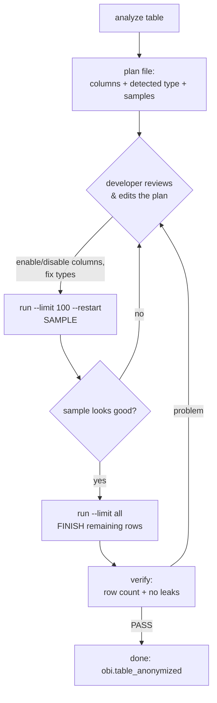
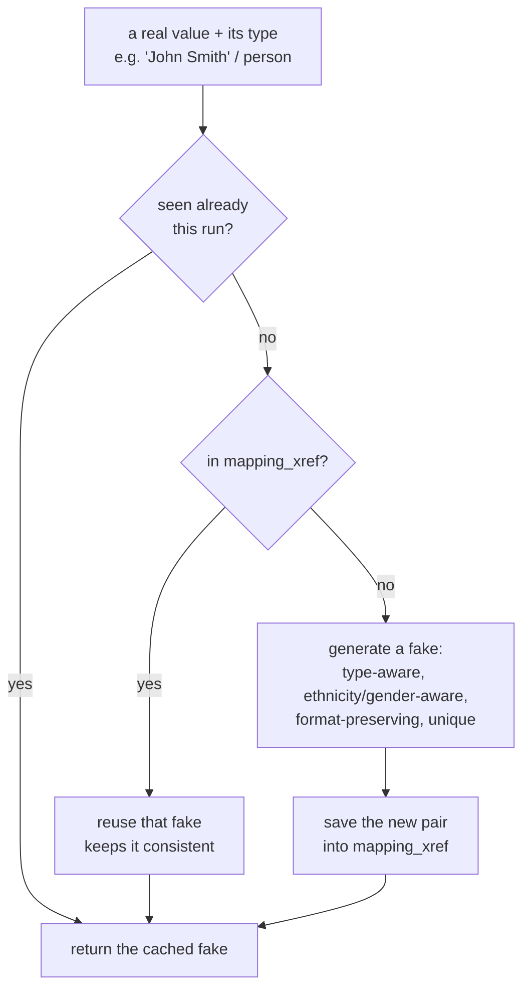

# OBI Data Anonymization — Approach

---

## 1. What problem this solves

Our database has real personal and business information — people's names, emails, phone
numbers, company names, and free text (chat/email bodies, descriptions) that mention them.
We need a copy of the data that looks and behaves like the real thing but does **not**
reveal anyone's real information, so it can be used safely for development, demos, and testing.

---

## 2. The core idea (in one picture)

```
  obi.<table>  (REAL data, read-only)
        │
        │   for each PII column we chose:
        │      replace each value with a fake one
        ▼
  obi.<table>_anonymized  (SAFE copy — same shape, fake values)
```

To decide "what fake value does this real value become?", we use one shared dictionary:

```
  obi.mapping_xref   (original value  →  fake value)
```

- If the real value is **already in `mapping_xref`**, we reuse the fake that's already there.
- If it's **not there**, we generate a fake for it and **save the new pair into `mapping_xref`**.

Because everything reads and writes the same dictionary, the **same real value always turns
into the same fake value** — in every row, every column, and every table. No other helper
tables are created.

---

## 3. What you run (the 4 steps)

You always work on **one table at a time**. On the VM:

```bash
PY=/mnt/obi/venv/bin/python

# STEP 1 — ANALYZE: look at the table and suggest which columns hold personal info
$PY obi_anonymizer.py analyze <table> [--sample-rows 500]

# STEP 2 — REVIEW & EDIT the plan file it created:  ./_state/<table>.plan.json
#          turn columns on/off ("enabled": true/false) and fix the "type" if needed
#          (this is where YOU decide exactly which columns get anonymized)

# STEP 3 — RUN: anonymize only the columns you enabled
$PY obi_anonymizer.py run <table> --limit 100 --restart   # do first 100 rows as a SAMPLE
#          ...look at obi.<table>_anonymized and check the sample looks right...
$PY obi_anonymizer.py run <table> --limit all             # do the rest (continues where it left off)

# STEP 4 — VERIFY: confirm row counts match and no real value leaked through
$PY obi_anonymizer.py verify <table>
```

Extra helpers:
```bash
$PY obi_anonymizer.py plan   <table>     # print the current plan
$PY obi_anonymizer.py status <table>     # show progress (how many rows done)
$PY obi_anonymizer.py reset  <table> [--restart]   # clear progress (and optionally empty the target)
```

---

## 4. The overall flow (diagram)



Plain words:
1. **Analyze** the table → it writes a plan listing every text column, with a guess of which
   ones are personal info and what type they are, plus a few sample values.
2. **You review the plan** and switch columns on/off and correct the type. You are in control.
3. **Run a small sample** (e.g. 100 rows) and eyeball the result.
4. When happy, **run the rest**. It picks up exactly where the sample stopped.
5. **Verify**. If it passes, the anonymized table is ready.

---

## 5. How a single value becomes a fake (the heart of it)



- **Cache**: within one run we remember values we've already converted, so repeats are instant.
- **Reuse**: if `mapping_xref` already has the value, we use the existing fake (consistency).
- **Generate + save**: otherwise we build a fake and insert the new `original → fake` pair back
  into `mapping_xref` so the next time (any row, any table, any run) we reuse it.

---

## 6. The types of personal info and how each is faked

| Type | Example columns | How the fake is made |
|---|---|---|
| **person** | name, firstname, author, manager, reporter, contact | realistic full name; keeps ethnicity (Indian→Indian, Chinese→romanized), gender, and 1-word vs 2-word shape |
| **email** | email, upn, windowsliveid | `first.last@domain` style; keeps the local-part shape; company part of the domain is faked (or forced-mapped) |
| **phone** | phone, mobile, fax | new digits but the **same format** (dashes, brackets, country code kept) |
| **org** | company, account, project/order name, legal entity | realistic company name; keeps legal suffixes (`PVT LTD`, `Inc`), keeps ALL-CAPS acronym shape |
| **freetext** | body, description, JSON blobs | uses **GLiNER** to find names/emails/orgs *inside* the text and replaces each one; keeps the rest of the sentence |

---

## 7. The properties we always keep (the promises)

1. **Consistent** — the same original always becomes the same fake, in every row and across
   every table (because everyone shares `mapping_xref`).
2. **Bijective / reversible** — two different originals never turn into the same fake. Each run
   keeps a list of fakes already used and re-rolls to a different clean fake if there's a clash.
   `mapping_xref` itself is the reverse lookup.
3. **Clean output — no weird suffixes** — a 2-word name becomes a clean 2-word name. We never
   glue on hex codes or numbers like `_a1b2c3d4` or `_0074`.
4. **Ethnicity preserved** — Indian names stay Indian-style, Chinese names become romanized
   Chinese, company names stay company-style.
5. **Format / shape preserved** — the fake looks like the original:
   - `UNSCO` (5 caps letters) → `VWXYZ` (5 caps letters)
   - `Centific PVT LTD` → `Aventraa PVT LTD` (only the name changes; `PVT LTD` stays)
   - `ALL CAPS` stays ALL CAPS, `Title Case` stays Title Case, phone formats stay the same.
6. **Forced word rule** — some words must always map to a fixed fake, wherever they appear
   (in a column, inside a company name, in an email domain, or inside free text):
   - `centific` → `aventraa`
   - `pactera` → `eventraa`
   These are case-preserving (`CENTIFIC`→`AVENTRAA`, `Centific`→`Aventraa`). You can add more
   in the `FORCED_MAP` dictionary at the top of the script.
7. **Source is never touched** — we only ever read `obi.<table>` and write `obi.<table>_anonymized`.

---

## 8. The checks we perform

- **Foreign-row guard (before writing):** if `<table>_anonymized` already exists with rows that
  this tool did **not** create (for example, old data from a previous process), the tool
  **refuses to run** until you pass `--restart` (which empties the target first). This stops us
  from accidentally trusting/keeping old, possibly-leaky data.
- **Row-count check (verify):** the anonymized table must have the same number of rows as the source.
- **Residual leak check (verify):** for each column we anonymized, it checks that no anonymized
  value is still exactly equal to a real source value. If any are, it flags `REVIEW`.
- **Uniqueness check (during run):** before assigning a fake, we make sure it isn't already used
  by a different original (keeps it reversible).
- **Sample-first workflow:** you always get to eyeball a small sample before committing to the
  full table.

---

## 9. Sample size, pause, and resume

- **`--limit N`** — process only `N` rows this time (great for a quick sample).
- **`--limit all`** (or `complete`) — process everything.
- **Progress is saved** after every batch in `./_state/<table>.ckpt.json`.
- **Pause:** press **Ctrl-C** — it finishes the current batch, saves progress, and stops cleanly.
- **Resume:** run the same `run` command again — it continues from where it stopped.
- **Redo from scratch:** add **`--restart`** — it empties the target and starts over.

So a typical real run is: sample 100 → check → `--limit all` → (if it pauses for any reason,
just run it again and it continues).

---

## 10. Requirements / libraries

Everything is already installed in the VM virtual environment `/mnt/obi/venv`.

| Library | Used for |
|---|---|
| `pyodbc` + ODBC Driver 17 for SQL Server | connecting to the Azure SQL database |
| `faker` | generating realistic fake names, companies, emails |
| `gliner` (model `urchade/gliner_multi_pii-v1`) | finding personal info **inside free text** |
| `ethnicseer` | detecting a name's likely ethnicity (Indian / Chinese) |
| `gender-guesser` | matching the fake first name to the original's gender |
| `pypinyin` | writing Chinese names in romanized (pinyin) form |
| Python standard library | `hashlib` (deterministic seeds), `re`, `json`, `argparse`, `signal` |

Notes:
- **GLiNER only loads when it's actually needed** — during `analyze`, and during `run` only if
  you enabled a free-text column. Tables with only normal columns run fast and never load it.
- If a library is missing, the tool degrades gracefully (e.g. no GLiNER → free-text columns are
  skipped with a warning; structured columns still work).

---

## 11. Where the fake values come from (consistency detail)

- **`mapping_xref`** is the single source of truth. Columns: `id` (auto), `description` (the
  type: `Names`, `Email`, `CompanyName`, `Phone`), `originalvalue`, `anonymizedvalue`, `comment`.
- At the start of a run we load the **whole** table into memory once (fast lookups, no per-value
  database calls).
- New pairs we generate are **written back in batches** (bulk insert) at each save point, so the
  tool stays fast even on large tables.
- `originalvalue` is `varchar(256)`. Values longer than 256 characters, or non-English-letter
  values, are still faked correctly in memory but are **not** written to `mapping_xref` (the
  column can't hold them safely). They stay consistent because generation is deterministic.

---

## 12. Edge cases we handle

- **"Last, First" names** — `Wilder, Hugh` is recognized as one person and treated the same as
  `Hugh Wilder`, so both get the same fake.
- **Case variations** — `CENTIFIC`, `Centific`, `centific` are the same word; the fake matches
  the original's casing.
- **Acronyms** — a short ALL-CAPS token like `UNSCO` becomes another same-length ALL-CAPS token,
  not a full company name.
- **Legal suffixes & filler words** — `PVT`, `LTD`, `Inc`, `LLC`, `GmbH`, `of`, `and`, `Global`
  are kept as-is; only the distinctive part of a company name is replaced.
- **Numbers inside a value** — a number like an order year stays a number (format preserved).
- **Internal vs external email domains** — the local part is always faked; the domain's company
  word is faked too (and `centific`/`pactera` follow the forced rule).
- **Free text** — names/emails/orgs mentioned inside a chat or description are each replaced, and
  the forced words (`centific`/`pactera`) are replaced everywhere in the text, even if GLiNER
  didn't tag them.
- **Collisions** — if a generated fake is already taken by a different original, we deterministically
  pick a different clean fake instead (never add a number/hex suffix).
- **Tables with no primary key** — many of these tables have no unique key. The tool orders rows
  by a combination of sortable columns so that pausing/resuming is still exact. For very large
  keyless tables, pass `--order-col <a unique column>` (e.g. `teams_chat` → `id`) to keep it fast.
- **Legacy "dirty" fakes already in `mapping_xref`** — the table already contains ~646 old fakes
  like `FakeCompany_01074` (with number suffixes). Because we reuse existing mappings, those can
  appear in output. If you want clean values there too, add **`--prefer-clean`** to `run`: it
  regenerates a clean fake for those and updates the `mapping_xref` row.
- **Identity columns** — if the target has an identity column, the tool turns on `IDENTITY_INSERT`
  so the original id values are preserved.
- **Big text columns (`nvarchar(max)`) / timestamps** — handled correctly (excluded from sort keys,
  timestamps not inserted).

---

## 13. What this tool does NOT do (so there's no confusion)

- It does **not** use or need the old `_canonical_map` or any of the earlier helper tables.
- It does **not** modify the source table — ever.
- It does **not** anonymize columns you didn't enable in the plan.
- It does **not** guarantee clean output for values that were already dirty in `mapping_xref`
  unless you use `--prefer-clean`.
- Reusing an existing `mapping_xref` pair takes priority over the format/forced rules — those
  rules apply to **newly generated** values (existing agreed mappings are kept for consistency).

---

## 14. Quick glossary

- **PII** — Personal / private information (names, emails, phones, company names, etc.).
- **Structured column** — a column where the whole cell is one thing (e.g. an email address).
- **Free text** — a column with sentences that may mention people/companies inside (e.g. a chat body).
- **Plan file** — the JSON list of columns you review and edit before running.
- **Checkpoint** — the saved progress marker that makes pause/resume work.
- **mapping_xref** — the shared original→fake dictionary that keeps everything consistent.

---

## 15. Files

| File | What it is |
|---|---|
| `obi_anonymizer.py` | the tool |
| `README.md` | short quick-start |
| `ANONYMIZATION_APPROACH.md` | this document (full explanation for developers) |
| `_state/<table>.plan.json` | the editable plan for a table |
| `_state/<table>.ckpt.json` | saved progress for a table |
